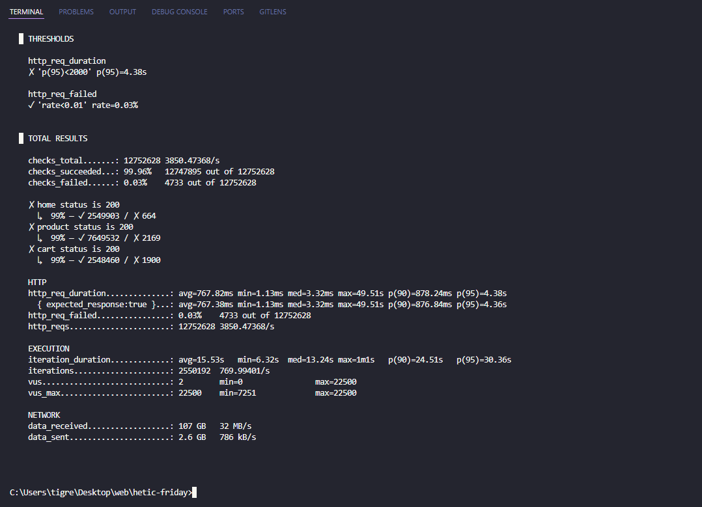
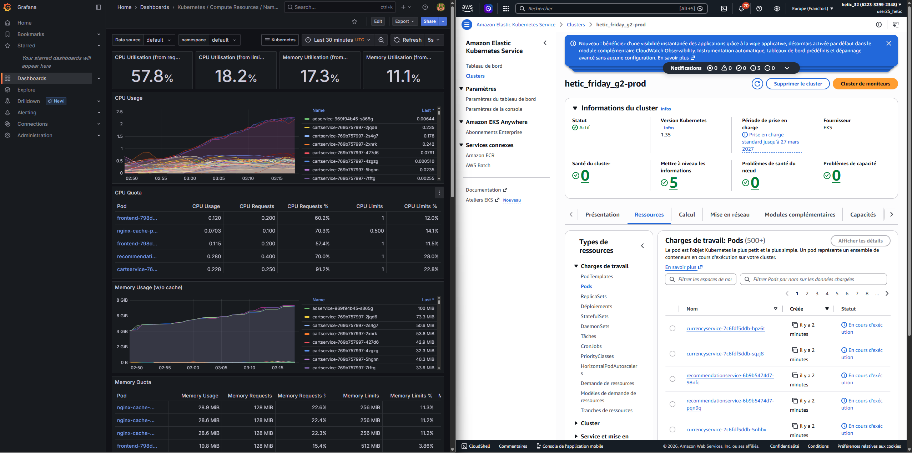

# Rapport Général — Black Friday Survival
## Simulation de Crise E-Commerce sur AWS

**HETIC MT5 - CTO & Tech Lead**
**Équipe G2 - Avril 2026**

---

## Présentation de l'équipe

Ce projet a été mené par une équipe de quatre étudiants en cinquième année de Mastère CTO & Tech Lead à HETIC, dans le cadre du projet pédagogique Black Friday Survival :

- **Adam Drici**
- **Ayline Travers**
- **Adrien Quacchia**
- **Adrien Quimbre**

Le code source du projet est disponible sur le dépôt Git suivant : [https://github.com/Doud75/hetic-friday](https://github.com/Doud75/hetic-friday)

---

## 1. Rappel de la Problématique — Black Friday Survival

Le Black Friday représente l'un des événements les plus stressants pour toute infrastructure e-commerce. En l'espace de quelques heures, le trafic peut être multiplié par vingt ou trente, transformant une plateforme habituellement stable en une cible de vulnérabilités en cascade : saturation des serveurs, latences exponentielles, indisponibilité des services, perte de transactions et atteinte directe à la réputation de l'enseigne. Des acteurs majeurs comme Amazon ou Cdiscount investissent des ressources colossales pour anticiper ces pics de charge. La moindre minute d'indisponibilité se chiffre en pertes financières considérables.

Le cahier des charges du projet Black Friday Survival nous a placés dans cette situation réelle : déployer, configurer et optimiser une plateforme e-commerce existante sur AWS, sans aucun développement applicatif, avec un focus exclusif sur l'infrastructure Cloud, les pratiques DevOps, la performance sous charge et la sécurité. L'objectif quantifié était clair et ambitieux : **tenir 90 000 utilisateurs simultanés sans crash**, avec une latence inférieure à 2 secondes pour 95 % des requêtes et un taux d'erreur inférieur à 1 %, le tout dans une enveloppe budgétaire de 1 500 à 2 000 euros sur trois semaines.

Le projet couvre trois modules fondamentaux progressivement approfondis : l'Architecture Cloud et l'Infrastructure as Code, la Sécurité Cloud, et enfin la Scalabilité et l'Observabilité. 

---

## 2. La Boutique E-Commerce Choisie — Google Online Boutique sur Kubernetes

Pour ce projet, nous avons retenu **Google Online Boutique**, une application de démonstration open source publiée par Google Cloud Platform. Cette boutique est composée de **11 microservices** distincts écrits dans des langages différents (Go, Python, Java, Node.js, C#), communicant entre eux via gRPC et HTTP. Elle comprend des services couvrant l'ensemble du parcours d'achat : navigation dans le catalogue produits, gestion du panier, passage de commande, paiement, recommandations, conversion de devises et envoi d'e-mails de confirmation.

Ce choix s'est imposé naturellement pour plusieurs raisons. Premièrement, l'application est conçue nativement pour Kubernetes et dispose déjà de manifests Helm et Kustomize maintenus et documentés. Deuxièmement, son architecture microservices en fait un candidat idéal pour tester les stratégies de scaling sélectif : chaque service peut être redimensionné indépendamment en fonction de sa consommation de ressources. Troisièmement, l'application intègre nativement OpenTelemetry, ce qui facilitait considérablement la mise en place du tracing distribué.

L'application a été déployée sur **Amazon EKS** (Elastic Kubernetes Service) dans la région AWS `eu-central-1` (Frankfurt), choix motivé par la proximité géographique avec nos utilisateurs simulés et la disponibilité de toutes les fonctionnalités AWS nécessaires au projet.

---

## 3. Infrastructure as Code — Terragrunt, EKS, S3 et DynamoDB

### 3.1 Choix de Terragrunt

La gestion de l'infrastructure repose intégralement sur **Terraform**, orchestré par **Terragrunt**. Ce wrapper autour de Terraform nous a permis d'appliquer le principe DRY (Don't Repeat Yourself) entre nos deux environnements `dev` et `prod`, qui partagent les mêmes modules mais avec des configurations distinctes : tailles d'instances différentes, nombre de NAT Gateways, et seuils de budget adaptés à chaque environnement.

La structure du projet suit le pattern `live/{env}/{module}/terragrunt.hcl`, avec un fichier `root.hcl` centralisant la configuration du backend. Les modules Terraform réutilisables sont regroupés dans `terraform/modules/` et couvrent : VPC, EKS, RDS, ALB, monitoring, sécurité, chaos-mesh, ECR, ESO et FinOps.

L'alternative des Terraform Workspaces a été écartée car elle implique un state partagé entre environnements — pratique risquée en contexte de production — et ne permet pas de gérer les dépendances entre modules. Terragrunt a été préféré à Pulumi, plus puissant mais nécessitant une montée en compétence que l'équipe ne pouvait pas s'offrir dans le délai imparti.

### 3.2 State Backend — S3 et DynamoDB

Le state Terraform est stocké de manière centralisée et sécurisée dans un **bucket S3** (`hetic-friday-g2-terraform-state`), avec verrouillage des opérations concurrentes via une table **DynamoDB** (`hetic-friday-g2-terraform-locks`). Ce dispositif est fondamental en équipe : sans verrouillage, deux membres exécutant `terragrunt apply` simultanément risquent de corrompre le state et de provoquer des états d'infrastructure incohérents. Le bucket S3 est configuré avec versioning activé pour permettre la restauration d'un état précédent en cas d'erreur.

### 3.3 EKS Auto Mode

Pour l'orchestration Kubernetes, nous avons opté pour **Amazon EKS en Auto Mode** avec un node pool `general-purpose`. EKS Auto Mode délègue entièrement à AWS la gestion des nodes : sélection des types d'instances, scaling des groupes de nœuds, application des mises à jour de sécurité. Cette approche « managed » nous a libérés d'une complexité opérationnelle significative et s'est révélée particulièrement adaptée à notre contexte pédagogique où l'essentiel de la valeur réside dans la configuration applicative et réseau plutôt que dans la gestion bas niveau des EC2.

---

## 4. Architecture Réseau — VPC Multi-Couches sur EKS Auto Mode

L'architecture réseau s'articule autour d'un **VPC unique** (`10.0.0.0/16`) déployé en région **eu-central-1**, réparti sur **3 zones de disponibilité** (eu-central-1a/b/c) et orchestré via **EKS Auto Mode (Kubernetes 1.34)**.

Le trafic des 90 000 utilisateurs entre par une **couche edge** composée d'un WAF v2 (5 règles) puis d'un ALB en path-based routing. À l'intérieur du cluster, les requêtes atteignent d'abord le **Nginx Cache Proxy** (HPA, ~80 % de cache hit dans le contexte de notre test de charge) qui absorbe la majorité du trafic ; les 20 % restants remontent vers le **Frontend Go** (HPA) puis les **Core Services** (ProductCatalog, CheckoutService, CartService, également sous HPA). Un ensemble de **Support Services** mutualisés (paiement, recommandation, devise, expédition, email, publicité) complète la couche applicative, épaulé par un Redis pour le cache distribué.

La **couche data** (subnets privés dédiés) isole une instance **RDS Primary** répliquée de façon synchrone vers un **RDS Standby Multi-AZ** en basculement automatique. Les sorties Internet des composants internes transitent par **3 NAT Gateways** (un par AZ) situés dans les subnets publics.

L'observabilité est assurée par Prometheus, Grafana et Jaeger, tandis que le plan CI/CD s'appuie sur Terragrunt, GitHub Actions et Chaos Mesh pour les tests de résilience.

---

## 5. Scalabilité — Gérer les 90 000 Utilisateurs Simultanés

### 5.1 Modification des Manifests Kubernetes et HPA

Le défi central du projet était de faire passer l'application d'une utilisation nominale à 90 000 utilisateurs simultanés sans dégradation de service. La première étape a consisté à adapter les manifests Kubernetes de l'application, originellement conçus pour un usage démonstratif avec des ressources minimales.

Des **Horizontal Pod Autoscalers (HPA)** ont été configurés sur les services les plus sollicités : frontend, cartservice, checkoutservice, currencyservice, productcatalogservice et recommendationservice. Chaque HPA définit un nombre minimal et maximal de réplicas, et déclenche le scaling dès que l'utilisation CPU ou mémoire dépasse un seuil configuré. Cette granularité service par service permet d'allouer les ressources là où la charge est réellement ressentie plutôt que de sur-provisionner uniformément.

EKS Auto Mode gère quant à lui le **Cluster Autoscaler** au niveau des nœuds : lorsque les HPA réclament davantage de pods et que les nœuds existants ne peuvent plus les accueillir, EKS provisionne automatiquement de nouveaux nœuds EC2.

### 5.2 Migration vers RDS PostgreSQL

Dans sa version d'origine, Google Online Boutique stocke le catalogue produits dans un **fichier JSON** embarqué dans le conteneur du service `productcatalogservice`. Cette approche est fonctionnelle pour une démonstration mais incompatible avec un déploiement multi-réplicas : chaque pod dispose de sa propre copie statique du catalogue, et toute modification nécessiterait un redéploiement.

Nous avons donc migré cette persistance vers une instance **RDS PostgreSQL** déployée en Multi-AZ. Le service `productcatalogservice` a été modifié pour interroger la base de données relationnelle plutôt que le fichier JSON local. RDS Multi-AZ garantit une bascule automatique en cas de défaillance de l'instance primaire, avec un temps de reprise inférieur à deux minutes — une exigence non négociable pour la disponibilité pendant le Black Friday.

Les credentials de connexion à la base de données ne sont jamais stockés en clair dans le code ou les manifests Kubernetes. Ils transitent par le flux suivant : déclaration dans un fichier `secrets.hcl` local (exclu du Git via `.gitignore`), provisionnement dans **AWS Secrets Manager** par Terraform, synchronisation vers les Kubernetes Secrets via l'**External Secrets Operator (ESO)**, puis injection dans les pods sous forme de variables d'environnement ou de volumes montés. L'ESO s'authentifie auprès d'AWS via IRSA (IAM Roles for Service Accounts), garantissant le principe du moindre privilège.

### 5.3 Proxy Cache Nginx

Pour alléger la charge sur le frontend, un **proxy cache Nginx** a été interposé devant le service frontend applicatif. Ce reverse proxy met en cache les réponses des pages produits et de la page d'accueil, réduisant significativement le nombre de requêtes atteignant effectivement les microservices en backend lors des pics de charge.

---

## 6. Tests de Charge — K6 dans EKS

La validation de la tenue en charge a été réalisée avec **K6**, une bibliothèque de test de performance open source particulièrement adaptée aux scenarios de montée en charge progressive. K6 a été déployé directement dans EKS sous forme de pods Kubernetes, bénéficiant ainsi d'une connexion réseau optimale vers l'ALB et s'affranchissant des limitations de bande passante qui auraient pu fausser les résultats depuis un poste local. **Les adresses IP des pods K6 ont été whitelistées dans le WAF** pour éviter que le rate-limiting ne bloque les requêtes de test.

Le scénario de test reproduit fidèlement les comportements réels d'un utilisateur lors d'un Black Friday : navigation sur la page d'accueil, consultation de plusieurs fiches produits sélectionnées aléatoirement dans le catalogue, ajout au panier, et passage de commande. Ce parcours réaliste génère un profil de charge bien plus représentatif qu'un simple bombardement de la page d'accueil.

La montée en charge a été configurée par paliers progressifs afin de laisser l'infrastructure le temps de s'adapter à chaque seuil :

- Échauffement à **5 000 utilisateurs** (2 minutes de montée, 3 minutes de stabilisation)
- Premier palier sérieux à **15 000 utilisateurs**
- Accélération à **40 000 utilisateurs** 
- Approche de l'objectif à **70 000 utilisateurs**
- Pic final à **90 000 utilisateurs** (5 minutes de montée, 10 minutes de stabilisation)
- Redescente progressive jusqu'à 0

(Si non indiqué, la montée à chaque palier suivant s'effectue en 5 minutes, avec 5 minutes de stabilisation une fois arrivé au palier indiqué)

Nous avons réalisé plusieurs tests de charge jusqu'au **test final avec 90 000 utilisateurs** simultanés. Les requêtes sont envoyés **simultanément sur 4 pods** EKS envoyant chacun jusqu'à 22 500 requêtes. L'illustration ci-dessus correspond à celui d'un de ces 4 pods.

Les indicateurs de performance technique sont excellents : avec un **taux d'échec de seulement 0,03 %**, nous nous situons très largement en deçà du seuil de tolérance du cahier des charges fixé à 1 %.

Notre **latence moyenne** est également très bonne compte tenu de la charge utilisateur avec environ **768ms**, la latence des 95% à 4.4s est acceptable mais peut encore être améliorée avec une montée en charge beaucoup plus progressive. Nous avons fait le choix de lancer le test avec un timing assez serré laissant juste le temps aux nouveaux pods de démarrer pendant le processus d'autoscaling, dans le but de tester les limites de notre architecture.
Enfin, la **mise en cache Nginx** de la page d'accueil et des pages produits s'est confirmée comme un levier majeur de réduction de la latence.

Durant le test, nous pouvons observer sur le dashboard Grafana une grande consommation de RAM par les 4 pods dédiés aux tests de charge. La charge de CPU moyenne de nos instance est passée de 0-1% en idle à 58% en fin de test. 

**L'autoscaling a répondu efficacement à la montée en charge**. Le parc applicatif est passé **de 90 à plus de 500 pods** pour absorber le flux de **90 000 utilisateurs simultanés**.

---

## 7. Sécurité Cloud

### 7.1 WAF et ALB

L'exposition des services vers Internet passe exclusivement par un **Application Load Balancer** provisionné via Terraform, adossé à un **AWS WAF v2**. Une contrainte technique est apparue en cours de projet : EKS Auto Mode ne pouvait pas provisionner automatiquement des Load Balancers sur notre compte AWS (erreur `OperationNotPermitted`). Cette limitation nous a conduits à gérer l'ALB entièrement via Terraform, ce qui s'est finalement révélé bénéfique : nous avons obtenu un contrôle total sur la configuration du WAF et le path-based routing.

Le WAF est configuré avec plusieurs règles de protection : protection contre les injections SQL, contre les attaques XSS via le Core Rule Set (CRS) OWASP, filtrage des inputs malveillants (incluant les patterns Log4Shell), et **rate-limiting à 2 000 requêtes par tranche de 5 minutes** par adresse IP source. Ce rate-limiting est essentiel pour limiter l'impact d'éventuelles attaques par déni de service distribué, tout en laissant passer le trafic légitime.

Le path-based routing de l'ALB expose deux points d'entrée : la racine `/` vers le proxy cache Nginx (qui sert l'application boutique), et le chemin `/grafana*` vers le service Grafana pour la supervision.

### 7.2 Gestion des Secrets — External Secrets Operator

La gestion des secrets applicatifs suit un pipeline sécurisé décrit dans la section précédente. L'External Secrets Operator, authentifié via IRSA, est le seul composant autorisé à lire les secrets depuis AWS Secrets Manager — sa policy IAM est strictement limitée à l'opération `secretsmanager:GetSecretValue` sur le secret RDS uniquement, illustrant le principe du moindre privilège.

### 7.3 VPC Flow Logs et Audit Réseau

Les **VPC Flow Logs** ont été activés pour enregistrer l'ensemble du trafic réseau traversant le VPC. Ces logs, stockés dans CloudWatch Logs, permettent l'audit post-incident : en cas d'anomalie ou de tentative d'intrusion, il est possible de reconstituer précisément les flux réseau impliqués, les adresses IP sources, les ports et les protocoles.

---

## 8. Observabilité — Grafana, Prometheus, CloudWatch et Jaeger

### 8.1 Stack Prometheus et Grafana

La supervision de l'infrastructure repose sur le **kube-prometheus-stack**, déployé via Helm dans le namespace `monitoring`. Ce chart tout-en-un installe Prometheus (collection et stockage des métriques), Grafana (visualisation et dashboards), AlertManager (routage des alertes), node-exporter (métriques système des nœuds) et kube-state-metrics (état des objets Kubernetes).

Prometheus collecte les métriques de l'ensemble des composants du cluster toutes les 15 secondes. Les métriques sont persistées sur des volumes EBS avec une rétention de 15 jours en production. Grafana, exposé via l'ALB sur le chemin `/grafana`, centralise des dashboards couvrant : l'utilisation CPU et mémoire par pod et par nœud, les latences et taux d'erreur par microservice, l'état des HPAs (réplicas cibles vs réplicas actuels), et les métriques de l'ALB et du WAF (requêtes bloquées, latence).

Des **PrometheusRule** ont été configurées pour déclencher des alertes AlertManager en cas de dépassement des seuils critiques : taux d'erreur HTTP supérieur à 1 %, latence supérieure à 2 secondes, ou pod en état CrashLoopBackOff. Ces alertes sont essentielles pour la réactivité en War Room.

### 8.2 Tracing Distribué avec Jaeger

Avec 11 microservices communicant entre eux, comprendre le parcours complet d'une requête est fondamental pour identifier les goulots d'étranglement. **Jaeger** a été déployé en mode `allInOne` dans le namespace `monitoring`, stockant jusqu'à 10 000 traces en mémoire. Ce mode mono-pod est suffisant pour le contexte pédagogique et évite la complexité d'un backend de stockage externe (Cassandra ou Elasticsearch).

Google Online Boutique instrumentant nativement ses microservices avec OpenTelemetry, Jaeger capture automatiquement les spans de chaque requête inter-service, permettant de visualiser en temps réel quelle étape de la chaîne (catalogue, panier, paiement, recommandation...) introduit de la latence sous charge.

### 8.3 CloudWatch

En parallèle de la stack open source, **AWS CloudWatch** est utilisé pour la supervision des ressources AWS natives : métriques des instances RDS (CPU, connexions actives, IOPS), logs des nœuds EKS, et alertes de dépassement budgétaire via les intégrations AWS Budgets.

---

## 9. Chaos Engineering — Tests de Résilience

La résilience d'une infrastructure ne se décrète pas, elle se prouve. C'est le principe fondateur du chaos engineering : injecter intentionnellement des défaillances pour vérifier que le système se rétablit automatiquement et que les équipes opérationnelles réagissent efficacement.

Nous avons déployé **Chaos Mesh** (CNCF Incubating) via un module Terraform dédié. Kubernetes-native, Chaos Mesh s'intègre via des Custom Resource Definitions (CRDs) permettant de déclarer des expériences de chaos sous forme de manifests YAML versionnés — exactement comme n'importe quelle autre ressource Kubernetes. Son dashboard intégré facilite la visualisation et le déclenchement des expériences en cours de War Room.

Trois catégories d'expériences ont été préconfigurées. Les **pannes de pods** (PodChaos) testent la capacité des HPAs et du scheduler Kubernetes à remplacer automatiquement les pods défaillants. Les **perturbations réseau** (NetworkChaos) simulent une latence accrue ou des pertes de paquets entre services spécifiques, révélant les dépendances fragiles et les absences de circuit breakers. Enfin, le **stress CPU et mémoire** (StressChaos) valide que le Cluster Autoscaler réagit correctement lorsque les ressources des nœuds sont saturées.

Un garde-fou fondamental a été mis en place : les expériences de chaos sont strictement limitées au namespace `hetic-friday` (les microservices applicatifs). Perturber le namespace `monitoring` rendrait l'observabilité impossible — on ne pourrait plus mesurer les effets du chaos — et perturber `kube-system` risquerait de déstabiliser l'ensemble du cluster.

---

## 10. CI/CD — GitHub Actions

La chaîne d'intégration et de déploiement continus est implémentée avec **GitHub Actions**, organisée en trois workflows distincts.

Le workflow de **CI sur Pull Request** (`ci-pr.yaml`) s'exécute automatiquement à chaque ouverture ou mise à jour d'une Pull Request. Il valide la syntaxe Terraform via `terraform validate`, exécute `terragrunt plan` pour vérifier que les changements d'infrastructure sont applicables, et valide la conformité des manifests Kubernetes.

Le workflow de **CI sur la branche main** (`ci-main.yaml`) s'exécute après chaque merge et réalise les mêmes validations que le précédent, mais avec des vérifications supplémentaires de lint sur les configurations de sécurité.

Le workflow de **déploiement continu** (`cd-main.yaml`) orchestre le déploiement effectif vers l'environnement cible. Il s'authentifie auprès d'AWS via des credentials stockés dans les secrets GitHub, exécute `terragrunt apply` sur les modules modifiés, puis déclenche le rechargement des manifests Kubernetes via `kubectl apply`.

Cette organisation garantit qu'aucune modification d'infrastructure ne peut être appliquée directement sans passer par le processus de revue de code, et que tout changement mergeé sur main est automatiquement propagé vers l'infrastructure — un prérequis pour maintenir la cohérence entre le code versionné et l'état réel du cloud.

---

## 11. Livrables et Références

Ce rapport général est accompagné de deux documents complémentaires approfondissant des aspects spécifiques du projet :

- **[Rapport FinOps]** — Détail de la stratégie de gestion des coûts cloud : budgets par semaine, utilisation des Spot Instances, rightsizing des instances, alertes AWS Budgets et analyse de la consommation réelle versus budgetée.

- **[Rapport Post-Mortem]** — Analyse détaillée des incidents survenus pendant la simulation Black Friday : chronologie des événements, impact mesuré, actions correctives appliquées en temps réel, et enseignements tirés pour une prochaine édition.

L'ensemble du code source, des Architecture Decision Records (ADRs), des dashboards Grafana exportés et des runbooks opérationnels est disponible sur le dépôt Git du projet : [https://github.com/Doud75/hetic-friday](https://github.com/Doud75/hetic-friday).