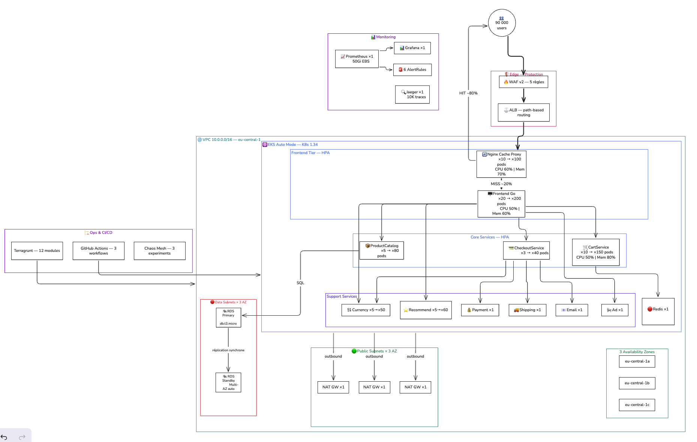
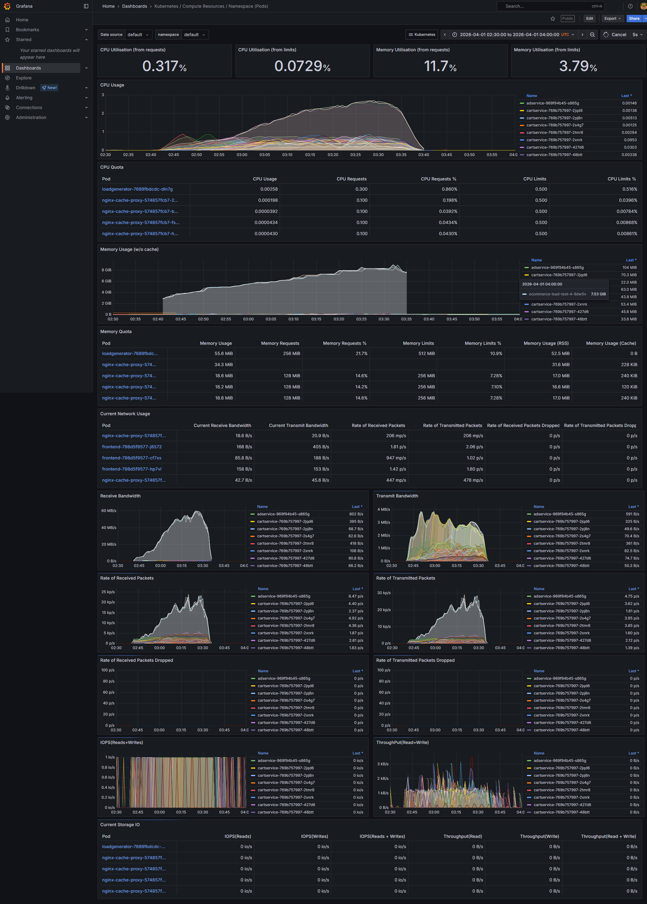

# BLACK FRIDAY SURVIVAL

<p class="text-2xl text-orange-400 font-bold mt-2">Simulation de Crise E-Commerce sur AWS</p>
<p class="text-gray-400 mt-2">HETIC MT5 · Groupe 2</p>

<div class="mt-10 flex gap-8 justify-center text-center">
  <div class="flex flex-col items-center gap-2">
    
    <div class="text-sm font-medium text-gray-200">Adrien Quimbre</div>
  </div>
  <div class="flex flex-col items-center gap-2">
    
    <div class="text-sm font-medium text-gray-200">Ayline Travers</div>
  </div>
  <div class="flex flex-col items-center gap-2">
    
    <div class="text-sm font-medium text-gray-200">Adrien Quacchia</div>
  </div>
  <div class="flex flex-col items-center gap-2">
    
    <div class="text-sm font-medium text-gray-200">Adam Drici</div>
  </div>
</div>

<!--
adrien s
-->

---
transition: fade
---

# Stack technique

<div class="flex items-center justify-center h-[80%]">
    <div class="grid grid-cols-4 gap-3 text-center text-sm w-full">
      <div class="bg-orange-900/30 border border-orange-500/30 rounded-lg p-3">
        <div class="text-orange-400 font-bold mb-1">IaC</div>
        <div class="text-gray-300 text-xs">Terraform · Terragrunt</div>
      </div>
      <div class="bg-blue-900/30 border border-blue-500/30 rounded-lg p-3">
        <div class="text-blue-400 font-bold mb-1">Compute</div>
        <div class="text-gray-300 text-xs">AWS EKS Auto Mode · Spot Instances</div>
      </div>
      <div class="bg-green-900/30 border border-green-500/30 rounded-lg p-3">
        <div class="text-green-400 font-bold mb-1">Réseau</div>
        <div class="text-gray-300 text-xs">ALB · WAF · VPC 3 tiers</div>
      </div>
      <div class="bg-purple-900/30 border border-purple-500/30 rounded-lg p-3">
        <div class="text-purple-400 font-bold mb-1">Data</div>
        <div class="text-gray-300 text-xs">RDS PostgreSQL Multi-AZ · Redis</div>
      </div>
      <div class="bg-yellow-900/30 border border-yellow-500/30 rounded-lg p-3">
        <div class="text-yellow-400 font-bold mb-1">Observabilité</div>
        <div class="text-gray-300 text-xs">Prometheus · Grafana · Jaeger</div>
      </div>
      <div class="bg-pink-900/30 border border-pink-500/30 rounded-lg p-3">
        <div class="text-pink-400 font-bold mb-1">CI/CD</div>
        <div class="text-gray-300 text-xs">GitHub Actions · ECR</div>
      </div>
      <div class="bg-red-900/30 border border-red-500/30 rounded-lg p-3">
        <div class="text-red-400 font-bold mb-1">Résilience</div>
        <div class="text-gray-300 text-xs">Chaos Mesh · HPA · EKS Auto mode</div>
      </div>
      <div class="bg-gray-700/50 border border-gray-500/30 rounded-lg p-3">
        <div class="text-gray-300 font-bold mb-1">Tests de charge</div>
        <div class="text-gray-300 text-xs">K6 · 4 pods EKS</div>
      </div>
    </div>
</div>

<!--
- IaC : Terraform pour décrire l'infra, Terragrunt pour moins de config, et structure module pour meilleur gestion du tfstate.
- Compute : EKS Auto Mode = AWS gère les nodes à notre place. Spot = 60-70% moins cher, AWS peut reprendre l'instance mais Kubernetes replace les pods automatiquement.
- Réseau : tout le trafic entre par l'ALB, les nodes sont dans des subnets privés sans IP publique.
- Data : RDS Multi-AZ = réplique synchrone, bascule auto en cas de panne. Redis pour les paniers.
-->

---
layout: section
transition: slide-up
---

# Architecture AWS
<p class="text-gray-400">VPC 3 tiers · EKS Auto Mode · ALB · RDS Multi-AZ</p>

<!--
adam

On va maintenant voir notre architecture AWS.
On a conçu un VPC 3 tiers réparti sur 3 zones de disponibilité à Frankfurt, avec EKS en Auto Mode pour l'orchestration et un RDS Multi-AZ pour la base de données.
-->

---
transition: fade
class: "!p-2"
---

<div class="flex flex-col items-center justify-center h-full">
  
  <p class="text-xs text-gray-500 mt-2">VPC 10.0.0.0/16 · 3 AZ eu-central-1 · EKS Auto Mode Kubernetes 1.34 · ALB · RDS Multi-AZ</p>
</div>

<!--
adam


1. ENTRÉE : Le trafic arrive d'Internet, passe par l'Internet Gateway, puis atterrit sur notre ALB 
— le point d'entrée unique de l'app. Devant l'ALB on a un WAF qui filtre les attaques : injection SQL, XSS, et un rate-limit à 2000 req/5min par IP.

2. COUCHE PUBLIQUE : Ici les subnets publics avec l'ALB et les NAT Gateways — 
un par AZ en prod, soit 3 au total. Le NAT permet aux pods privés de télécharger des images Docker sans être exposés sur Internet.

3. COUCHE PRIVÉE : C'est là que tourne l'app. Les EKS Nodes sont répartis sur les 3 AZ. 
On utilise EKS Auto Mode, AWS provisionne et scale les nœuds automatiquement. 
Nos pods — frontend, cart service, checkout — tournent ici, sans aucune IP publique.

4. COUCHE DATA : La plus protégée. RDS PostgreSQL Multi-AZ avec réplication synchrone.
 Si la primaire tombe, bascule automatique en quelques secondes. 
 Le trafic est restreint au port 5432, uniquement depuis les subnets privés.

5. RÉSUMÉ : Défense en profondeur —
Chaque couche ne communique qu'avec ses voisines via Security Groups et NACLs.
Un utilisateur ne voit que l'ALB, les pods ne voient que le réseau privé, la DB ne parle qu'aux pods.
-->

---
layout: section
transition: slide-up
---

# Infrastructure as Code
<p class="text-gray-400">Terraform + Terragrunt · State S3 · DynamoDB locking</p>

<!--
adam

Toute cette infra, on ne l'a pas créée à la main dans la console AWS.
 C'est du 100% Infrastructure as Code avec Terraform et Terragrunt.
-->

---
layout: two-cols
zoom: 0.9
transition: fade
---

# Notre architecture IaC

<v-clicks>

**6 modules Terraform réutilisables**

- `vpc` — VPC, subnets, NAT Gateways, route tables
- `eks` — Cluster EKS Auto Mode + node groups
- `rds` — PostgreSQL Multi-AZ
- `security` — Security Groups, IAM, NACLs, WAF
- `monitoring` — CloudWatch + SNS
- `monitoring-k8s` — Prometheus + Grafana (Helm)

**2 environnements** via Terragrunt

- `live/dev/` — 1 NAT GW, instances réduites
- `live/prod/` — 3 NAT GW, Spot app nodes

</v-clicks>

::right::

<div class="pl-4">

<v-click>

```hcl
# live/prod/eks/terragrunt.hcl
include "root" {
  path = find_in_parent_folders("root.hcl")
}
terraform {
  source = "../../../terraform/modules/eks"
}
dependency "vpc" {
  config_path = "../vpc"
}
inputs = {
  environment        = "prod"
  vpc_id             = dependency.vpc.outputs.vpc_id
  private_subnet_ids = dependency.vpc.outputs.private_subnet_ids
  cluster_version    = "1.34"
}
```

</v-click>

<v-click>

```bash
# Déploiement ordonné, state centralisé
cd live/prod && terragrunt run-all apply
# S3 : hetic-friday-g2-terraform-state
# Lock : DynamoDB table
```

</v-click>

</div>

<!--
adam

**Colonne gauche :**
On a 6 modules Terraform réutilisables : VPC, EKS, RDS, Security,
 Monitoring CloudWatch, et Monitoring K8s pour Prometheus/Grafana via Helm.

On a 2 environnements gérés par Terragrunt : dev (minimaliste, 1 NAT GW) et prod (haute dispo, 3 NAT GW).

**Colonne droite :**
Ici un exemple concret de fichier Terragrunt. On voit qu'il pointe vers le module EKS, qu'il récupère le VPC ID en dépendance — donc Terragrunt sait qu'il faut créer le VPC AVANT EKS — et il injecte les paramètres spécifiques à la prod.

Pour déployer toute l'infra, c'est une seule commande : terragrunt run-all apply. 
Le state est centralisé dans S3 avec un lock DynamoDB pour éviter les conflits 
si quelqu'un d'autre fait un apply en même temps.
-->

---
layout: section
transition: slide-up
---

# Réseau & Sécurité
<p class="text-gray-400">VPC Multi-AZ · WAF · IAM Least Privilege</p>

<!--
ayline
-->

---
zoom: 0.85
transition: fade
---

# Notre design réseau

<div class="flex flex-col justify-center h-[80%] gap-3">

<div class="grid grid-cols-3 gap-3 text-sm">

<div class="bg-red-900/25 border border-red-500/30 rounded-lg p-3">
  <div class="text-red-400 font-bold mb-2">🌐 Public — 10.0.0.0/20</div>
  <ul class="space-y-1 text-gray-300 text-xs">
    <li>ALB (entrée unique)</li>
    <li>NAT Gateways × 3</li>
  </ul>
  <div class="mt-2 text-xs text-gray-500"><code>kubernetes.io/role/elb=1</code></div>
</div>

<div class="bg-blue-900/25 border border-blue-500/30 rounded-lg p-3">
  <div class="text-blue-400 font-bold mb-2">⚙️ Private — 10.0.16.0/20</div>
  <ul class="space-y-1 text-gray-300 text-xs">
    <li>EKS worker nodes</li>
    <li>Pods applicatifs</li>
    <li>Pas d'IP publique</li>
  </ul>
  <div class="mt-2 text-xs text-gray-500"><code>kubernetes.io/role/internal-elb=1</code></div>
</div>

<div class="bg-green-900/25 border border-green-500/30 rounded-lg p-3">
  <div class="text-green-400 font-bold mb-2">🗄️ Data — 10.0.32.0/21</div>
  <ul class="space-y-1 text-gray-300 text-xs">
    <li>RDS PostgreSQL Multi-AZ</li>
    <li>Redis (cart service)</li>
    <li>Isolé du reste</li>
  </ul>
  <div class="mt-2 text-xs text-gray-500">Port 5432 depuis nodes SG uniquement</div>
</div>

</div>

<div class="grid grid-cols-2 gap-3">

<div v-click class="bg-gray-800/60 border border-gray-600 rounded-lg p-3 text-sm">
  <div class="text-yellow-400 font-bold mb-2">🔒 WAF & NACLs</div>
  <ul class="space-y-1 text-gray-300 text-xs">
    <li>AWS WAF devant l'ALB — règles OWASP Core</li>
    <li>Rate limiting : 2 000 req/5min par IP</li>
    <li>NACLs par couche réseau</li>
  </ul>
</div>

<div v-click class="bg-gray-800/60 border border-gray-600 rounded-lg p-3 text-sm">
  <div class="text-purple-400 font-bold mb-2">🪪 IAM Least Privilege</div>
  <ul class="space-y-1 text-gray-300 text-xs">
    <li>IRSA — un rôle IAM par service K8s</li>
    <li>Secrets Manager pour credentials RDS</li>
    <li>Rotation automatique activée</li>
  </ul>
</div>

</div>

</div>

<!--
ayline
-->

---
layout: section
transition: slide-up
---

# EKS & Auto-Scaling
<p class="text-gray-400">HPA · Spot Instances · Cluster Autoscaler</p>

<!--
adrien j
-->

---
layout: two-cols
zoom: 0.9
transition: fade
---

# Stratégie de scaling — Nodes & HPA

**Node groups**

- **System** : On-Demand — stabilité control plane
- **App** : Spot — **60-70%** moins cher que On-Demand

**HPA** : scale-up +200% / 15s, scale-down conservateur (10 min)

::right::

<div class="pl-4">

```yaml
# app/kubernetes-manifests/frontend-hpa.yaml
spec:
  minReplicas: 20
  maxReplicas: 200
  metrics:
    - type: Resource
      resource:
        name: cpu
        target:
          averageUtilization: 50
    - type: Resource
      resource:
        name: memory
        target:
          averageUtilization: 60
  behavior:
    scaleUp:
      stabilizationWindowSeconds: 30
      policies:
        - {type: Percent, value: 200, periodSeconds: 15}
    scaleDown:
      stabilizationWindowSeconds: 600
```

</div>

<!--
adrien j
-->

---
layout: two-cols
zoom: 0.9
transition: fade
---

# Stratégie de scaling — Résultats

**Seuils HPA par service (90K users)**

| Service | Min | Max |
|---|---|---|
| frontend | 20 | 200 |
| cartservice | 5 | 100 |
| productcatalog | 5 | 80 |
| recommendationservice | 3 | 60 |
| currencyservice | 3 | 50 |
| checkoutservice | 3 | 40 |

::right::

<div class="pl-4">

**Cluster Autoscaler**

- Provisionnement nœud Spot : ~2-4 min
- Scale-down conservateur : fenêtre 10 min
- Max nodes configuré : **20** (prod)

<div class="mt-6 bg-blue-900/30 border border-blue-500/40 rounded-lg p-4">
  <div class="text-blue-400 font-bold mb-2">Politique de scale-down (incident #7)</div>
  <ul class="text-gray-300 text-sm space-y-1">
    <li>Scale-down agressif → erreurs 500 gRPC sur CartService</li>
    <li>Fix : stabilisationWindow 600s + preStop 15s</li>
    <li>Appliqué sur tous les HPAs du projet</li>
  </ul>
</div>

</div>

<!--
adrien j
-->

---
layout: section
transition: slide-up
---

# CI/CD
<p class="text-gray-400">GitHub Actions · EKS</p>

<!--
adrien s
-->

---
zoom: 0.85
transition: fade
---

# Notre pipeline CI/CD

<div class="flex flex-col justify-center h-[80%] gap-3">

<div class="grid grid-cols-3 gap-3">

<div v-click class="bg-gray-800/60 border border-gray-600 rounded-lg p-3 text-xs">
  <div class="text-blue-400 font-bold mb-2 text-sm">PR → main</div>
  <ol class="space-y-1 text-gray-300 list-decimal list-inside">
    <li>Tests unitaires (Go, C#)</li>
    <li>Build images</li>
    <li>Smoke tests</li>
    <li>Scan Trivy (images)</li>
  </ol>
</div>

<div v-click class="bg-gray-800/60 border border-gray-600 rounded-lg p-3 text-xs">
  <div class="text-green-400 font-bold mb-2 text-sm">Push main</div>
  <ol class="space-y-1 text-gray-300 list-decimal list-inside">
    <li>Mêmes checks PR</li>
    <li>Push images vers ECR</li>
    <li>Validation smoke tests</li>
  </ol>
</div>

<div v-click class="bg-gray-800/60 border border-gray-600 rounded-lg p-3 text-xs">
  <div class="text-orange-400 font-bold mb-2 text-sm">CD → prod EKS</div>
  <ol class="space-y-1 text-gray-300 list-decimal list-inside">
    <li>Déclenchement manuel</li>
    <li>Update kubeconfig EKS</li>
    <li>Apply manifests prod</li>
    <li>Rollout status check</li>
  </ol>
</div>

</div>

<v-click>

```yaml
# .github/workflows/cd-main.yaml
- name: Deploy to EKS
  run: |
    aws eks update-kubeconfig --name hetic_friday_g2-prod --region eu-central-1
    kubectl apply -f app/release/kubernetes-manifests.yaml
    kubectl rollout status deployment/frontend --timeout=300s
```

</v-click>

</div>

<!--
- PR : tests + build + smoke tests sur un cluster local (kind), rien ne touche AWS.
- Push main : idem + push des images vers ECR (le registre Docker d'AWS).
- CD : déclenché manuellement, c'est volontaire — on veut une validation humaine avant de toucher la prod.
Le code yaml montré c'est la vraie commande qui tourne : update kubeconfig pour parler au cluster EKS, apply des manifests, vérification que le déploiement s'est bien passé.
-->

---
layout: section
transition: slide-up
---

# Observabilité
<p class="text-gray-400">Prometheus · Grafana · Jaeger · Alerting</p>

<!--
adam

Pour surveiller tout ça sous une charge de 90 000 utilisateurs,
 on a mis en place une stack d'observabilité complète qui couvre 
 les 4 piliers : métriques, logs, tracing et alerting.
-->

---
layout: two-cols
zoom: 0.88
transition: fade
---

# Stack monitoring

<v-clicks>

**Déployé via Terraform (Helm provider)**
- Prometheus — rétention 15j, EBS `ebs-auto`
- Grafana — dashboards Black Friday custom
- Jaeger — tracing distribué all-in-one (10K traces)
- CloudWatch + SNS — alertes infra

**Stack complète**

| Pilier | Outil |
|---|---|
| Metrics | Prometheus + Grafana |
| Logs | CloudWatch |
| Tracing | Jaeger (OTLP) |
| Alerting | PrometheusRule + AlertManager |

</v-clicks>

::right::

<div class="pl-4">

<v-click>

**Alertes PrometheusRule**

```yaml
# PrometheusRule — alertes Black Friday
rules:
  - alert: HighLatencyP95
    expr: histogram_quantile(0.95,
      sum(rate(http_server_request_duration_seconds_bucket
      [5m])) by (le, service)) > 2
    for: 2m

  - alert: HighErrorRate
    expr: sum(rate(http_server_request_duration_seconds_count
      {http_status_code=~"5.."}[5m])) by (service)
      / sum(rate(...[5m])) by (service) > 0.01
    for: 2m
```

</v-click>

<v-click>

**Seuils surveillés (objectifs cahier des charges)**

```
🎯 Latence p95 < 2s
🎯 Error rate < 1%
🎯 HPAMaxedOut → alerte si HPA bloqué 10 min
🎯 PodCrashLooping → alerte si > 3 restarts/15 min
```

</v-click>

</div>

<!--
adam

**Colonne gauche :**
Tout est déployé via Terraform avec le provider Helm :
- Prometheus collecte les métriques (CPU, mémoire, latence, taux d'erreur) avec 15 jours de rétention sur un disque EBS — c'est un disque dur virtuel dans le cloud, 50 Go, qui persiste même si le pod redémarre
- Grafana affiche tout ça dans des dashboards custom
- Jaeger fait du tracing distribué :
 on suit une requête à travers tous les microservices pour identifier les goulots d'étranglement
- AlertManager déclenche des alertes automatiques
- Et on a aussi CloudWatch + SNS côté AWS : ça surveille l'infra en dessous du cluster (les NAT Gateways, le réseau). Si le cluster EKS tombe, Prometheus tombe avec. Mais CloudWatch continue de tourner et nous envoie des emails via SNS.

**Colonne droite :**
On a des règles d'alertes personnalisées pour le Black Friday :
- Latence p95 > 2 secondes
- Taux d'erreur > 1%
- Pod qui crash en boucle
- Et surtout si le HPA est au max depuis plus de 10 minutes → ça veut dire qu'on ne peut plus scaler,
 il faut intervenir manuellement.
-->

---
transition: fade
class: "!p-2"
---

# Dashboard Grafana — test 90K users

<div class="flex flex-col items-center justify-center h-full">
  
  <p class="text-xs text-gray-500 mt-2">CPU moyen ~58% en pic · 90 → 500+ pods · autoscaling HPA actif</p>
</div>

<!--
adam

Voilà notre dashboard Grafana en plein test de charge à 90 000 utilisateurs.
 On voit le CPU moyen à 58% en pic, le parc qui passe de 90 à plus de 500 pods grâce au HPA,
  et la latence qui reste contenue.
   Tout ça sans intervention manuelle.
-->

---
layout: section
transition: slide-up
---

# Tests de Charge
<p class="text-gray-400">K6 · 4 pods EKS · 90 000 utilisateurs simultanés</p>

<!--
adrien j
-->

---
layout: two-cols
zoom: 0.88
transition: fade
---

# Scénario K6

**K6 déployé directement dans EKS**
- 4 pods envoyant chacun 22 500 VUs
- IPs whitelistées dans le WAF (évite le rate-limiting)
- Parcours réaliste : accueil → fiche produit → panier → commande

**Montée en charge par paliers**

<v-click>

| Palier | VUs | Durée montée | Stabilisation |
|---|---|---|---|
| Échauffement | 5 000 | 2 min | 3 min |
| Palier 1 | 15 000 | 5 min | 5 min |
| Palier 2 | 40 000 | 5 min | 5 min |
| Palier 3 | 70 000 | 5 min | 5 min |
| **Pic final** | **90 000** | **5 min** | **10 min** |

</v-click>

::right::

<div class="pl-4">

<v-click>

**Résultats mesurés (pod 1/4)**


</v-click>

</div>

<!--
adrien j
-->

---
zoom: 0.88
transition: fade
---

# Résultats du test de charge

<div class="flex flex-col justify-center h-[80%] gap-3">
<div class="grid grid-cols-3 gap-4 mt-4">

<div class="bg-green-900/30 border border-green-500/40 rounded-lg p-4 text-center">
  <div class="text-3xl font-bold text-green-400">0.03%</div>
  <div class="text-sm text-gray-400 mt-1">taux d'échec</div>
  <div class="text-xs text-gray-500 mt-1">objectif &lt; 1% ✓</div>
</div>

<div class="bg-blue-900/30 border border-blue-500/40 rounded-lg p-4 text-center">
  <div class="text-3xl font-bold text-blue-400">768ms</div>
  <div class="text-sm text-gray-400 mt-1">latence moyenne</div>
  <div class="text-xs text-gray-500 mt-1">sous 90K utilisateurs</div>
</div>

<div class="bg-yellow-900/30 border border-yellow-500/40 rounded-lg p-4 text-center">
  <div class="text-3xl font-bold text-yellow-400">4.4s</div>
  <div class="text-sm text-gray-400 mt-1">latence p95</div>
  <div class="text-xs text-gray-500 mt-1">montée en charge volontairement rapide</div>
</div>

</div>

<div class="grid grid-cols-2 gap-4 mt-4 text-sm">

<div class="bg-gray-800/60 border border-gray-600 rounded-lg p-3">
  <div class="text-orange-400 font-bold mb-1">Autoscaling</div>
  <p class="text-gray-300 text-xs">Parc applicatif : <strong class="text-white">90 → 500+ pods</strong> sous charge</p>
  <p class="text-gray-300 text-xs mt-1">HPA + Cluster Autoscaler ont répondu sans intervention</p>
</div>

<div class="bg-gray-800/60 border border-gray-600 rounded-lg p-3">
  <div class="text-purple-400 font-bold mb-1">Cache Nginx</div>
  <p class="text-gray-300 text-xs">~80% de cache hit sur les pages produits et accueil</p>
  <p class="text-gray-300 text-xs mt-1">Levier majeur de réduction de latence sous charge</p>
</div>

</div>
</div>

<!--
adrien j
-->

---
layout: section
transition: slide-up
---

# Chaos Engineering
<p class="text-gray-400">Chaos Mesh · Résilience testée avant le jour J</p>

<!--
ayline
-->

---
layout: two-cols
zoom: 0.88
transition: fade
---

# Ce qu'on a cassé (volontairement)

**3 expériences Chaos Mesh (CNCF)**

<v-clicks>

- `pod-kill-random` — self-healing < 30s, zéro downtime
- `network-delay-200ms` — p95 monte à 2.1s, alerte déclenchée ✓
- `cpu-stress-frontend` — HPA scale +replicas automatiquement

**Ciblé uniquement sur `hetic-friday`**  
→ monitoring et kube-system protégés

</v-clicks>

<v-click>

| Expérience | Durée | Résultat |
|---|---|---|
| pod-kill-random | 30s | Pod recréé < 30s |
| network-delay-200ms | 2 min | Alerte Prometheus ✓ |
| cpu-stress-frontend | 3 min | HPA réagit ✓ |

</v-click>

::right::

<div class="pl-4">

<v-click>

```yaml
# NetworkChaos — Chaos Mesh
apiVersion: chaos-mesh.org/v1alpha1
kind: NetworkChaos
metadata:
  name: network-delay-200ms
  namespace: chaos-mesh
spec:
  action: delay
  mode: all
  selector:
    namespaces: [hetic-friday]
    labelSelectors:
      app: frontend
  delay:
    latency: "200ms"
    jitter: "50ms"
  duration: "2m"
```

</v-click>

<v-click>

```bash
# Accès au dashboard Chaos Mesh
kubectl port-forward svc/chaos-dashboard \
  -n chaos-mesh 2333:2333
```

> Chaque expérience valide un comportement avant le jour J.

</v-click>

</div>

<!--
ayline
-->

---
layout: section
transition: slide-up
---

# Post-Mortem
<p class="text-gray-400">Ce qu'on a rencontré · Ce qu'on a appris</p>

<!--
adam

On a rencontré plusieurs vrais incidents pendant le déploiement.
 Voici les 5 principaux et comment on les a résolus.
-->

---
zoom: 0.82
transition: fade
---

# Incidents réels pendant le déploiement

<div class="grid grid-cols-2 gap-3 mt-2 text-xs">

<div v-click class="bg-red-900/20 border border-red-500/30 rounded-lg p-3">
  <div class="text-red-400 font-bold mb-1 text-sm">ALB non créable automatiquement</div>
  <p class="text-gray-300">Le <code>LoadBalancer</code> des services K8s restait en <code>Pending</code> indéfiniment.</p>
  <p class="text-green-300 mt-1">→ ALB créé via Terraform + <code>TargetGroupBindings</code> K8s pour enregistrer les IPs des pods automatiquement.</p>
  <p class="text-gray-500 mt-1">EKS Auto Mode synchronise les Target Groups quand les pods scale ou restart.</p>
</div>

<div v-click class="bg-yellow-900/20 border border-yellow-500/30 rounded-lg p-3">
  <div class="text-yellow-400 font-bold mb-1 text-sm">Pods en Pending — subnets non taggés</div>
  <p class="text-gray-300">EKS Auto Mode ne découvrait pas les subnets privés.</p>
  <p class="text-orange-300 mt-1">→ Tag ajouté manuellement, puis intégré dans le module <code>vpc</code>.</p>
  <p class="text-gray-500 mt-1"><code>kubernetes.io/cluster/hetic_friday_g2-prod=owned</code></p>
</div>

<div v-click class="bg-blue-900/20 border border-blue-500/30 rounded-lg p-3">
  <div class="text-blue-400 font-bold mb-1 text-sm">Prometheus PVC — mauvaise StorageClass</div>
  <p class="text-gray-300"><code>gp2</code> incompatible EKS Auto Mode → PVC en <code>Pending</code>.</p>
  <p class="text-green-300 mt-1">→ Migration vers <code>ebs-auto</code>. Fixé dans <code>monitoring-k8s/main.tf</code>.</p>
  <p class="text-gray-500 mt-1">Helm timeout aussi augmenté à 900s (provisioning plus lent)</p>
</div>

<div v-click class="bg-purple-900/20 border border-purple-500/30 rounded-lg p-3">
  <div class="text-purple-400 font-bold mb-1 text-sm">EIPs orphelines — AddressLimitExceeded</div>
  <p class="text-gray-300">4 EIPs de sessions Terraform avortées → limite AWS atteinte.</p>
  <p class="text-green-300 mt-1">→ Libération manuelle. Runbook : vérifier les EIPs avant tout <code>apply</code>.</p>
</div>

<div v-click class="bg-orange-900/20 border border-orange-500/30 rounded-lg p-3 col-span-2">
  <div class="text-orange-400 font-bold mb-1 text-sm">Erreurs 500 sous charge — scale-down prématuré CartService</div>
  <p class="text-gray-300">Au-delà de 30K VUs : taux d'erreur 3-8% sur CartService. HPA détruisait des pods avec des connexions gRPC actives.</p>
  <p class="text-green-300 mt-1">→ <code>stabilizationWindowSeconds: 600</code> + hook <code>preStop: sleep 15</code> + <code>terminationGracePeriodSeconds: 120</code></p>
</div>

</div>

<!--
adam

**Pointer chaque carte une par une :**

1. ALB : Le type LoadBalancer des services K8s restait en Pending sur notre compte. 
On a contourné ça en créant l'ALB via Terraform, avec des TargetGroupBindings 
pour que EKS Auto Mode enregistre automatiquement les IPs des pods dans les Target Groups. 
Quand le HPA scale ou qu'un pod restart, c'est transparent.

2. PODS PENDING : Nos subnets privés n'avaient pas les bons tags pour qu'EKS Auto Mode les découvre.
 On a ajouté le tag kubernetes.io/cluster et intégré ça dans le module VPC Terraform.

3. PROMETHEUS : La StorageClass gp2 n'est pas compatible avec EKS Auto Mode.
 Le PVC restait en Pending. On a migré vers ebs-auto, la classe native d'Auto Mode.

4. EIPs : Des Terraform apply avortés laissaient des Elastic IPs orphelines.
 On a atteint la limite AWS. Libération manuelle + runbook pour vérifier avant chaque apply.

5. LE PLUS CRITIQUE — Erreurs 500 : Le HPA détruisait des pods CartService 
qui avaient encore des connexions gRPC actives. 
Fix : stabilisation scale-down à 10 min + hook preStop de 15s pour laisser
 les connexions se terminer proprement.
-->

---
layout: section
transition: slide-up
---

# FinOps
<p class="text-gray-400">Optimisations · Budget réel · Spot Instances</p>

<!--
adrien s
-->

---
layout: two-cols
zoom: 0.88
transition: fade
---

# Gestion des coûts

**Optimisations implémentées**

<v-clicks>

- Spot Instances app nodes → **60-70% moins cher** que On-Demand
- 1 NAT GW en dev vs 3 en prod → **~64 €/mois** d'écart
- VPC Endpoints S3/ECR → trafic NAT réduit
- Lifecycle policy ECR — images non taguées à 24h
- RDS `db.t3.micro` — charge réelle légère sur Online Boutique
- Prometheus : rétention 7j dev / 15j prod

</v-clicks>

::right::

<div class="pl-4">

<v-click>

**Budget par phase (fourchettes cibles)**

| Phase | Budget cible |
|---|---|
| Semaine 1 | 150-250 € |
| Semaine 2 | 400-600 € |
| Semaine 3 | 500-700 € |
| Démo (2j) | 150-250 € |
| **Total** | **1 320-2 000 €** |

</v-click>

<v-click>

**AWS Budgets — 4 alertes**

- 50% consommé → informatif
- 80% → avertissement
- 100% → critique
- 100% forecast → action préventive

</v-click>

</div>

<!--
- Spot Instances : le levier principal, 60-70% d'économies sur les nodes applicatifs. Acceptable car Kubernetes replace les pods si AWS reprend une instance.
- 1 NAT GW en dev vs 3 en prod : en dev on accepte qu'une panne d'AZ coupe l'accès Internet, en prod non.
- VPC Endpoints : le trafic vers S3 et ECR reste sur le réseau AWS, ne passe pas par le NAT GW → gratuit.
- Budget : fourchettes cibles, pas de chiffres réels mesurés. Les alertes AWS Budgets nous préviennent à 50/80/100%.
- Les 4 alertes : 50% = informatif, 80% = il reste de la marge pour réagir, 100% = dépassé, 100% forecast = AWS prédit le dépassement avant qu'il arrive (le plus utile).
-->

---
layout: fact
transition: zoom
---

# 90 000 users

**0.03% d'erreurs · 768ms latence moyenne · 500+ pods**

<!--
adrien s
-->

---
layout: end
transition: fade
---

# Merci

<!--
adrien s
-->
